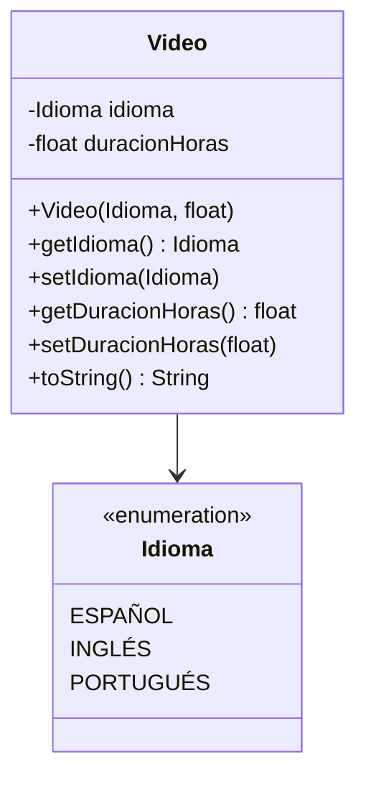

# Proyecto Clase Video

Este proyecto implementa una clase `Video` en Java que representa un video con atributos de idioma y duración en horas.

## Clase Video

La clase `Video` tiene los siguientes atributos:
- `idioma`: Una enumeración `Idioma` con valores ESPAÑOL, INGLÉS, PORTUGUÉS.
- `duracionHoras`: Un float que representa la duración en horas.

Incluye constructor, getters, setters y método `toString()`.

## Enumeración Idioma

Define los idiomas disponibles para el video: ESPAÑOL, INGLÉS, PORTUGUÉS.

## Clase Main

La clase `Main` contiene el método principal que:
- Pide al usuario el idioma del video.
- Pide la duración en horas.
- Crea una instancia de `Video`.
- Imprime los datos del video en pantalla.

## Diagrama de Clases



## Cómo ejecutar

Compilar y ejecutar `Main.java` con un compilador Java.

Ejemplo de ejecución:
```
Ingrese el idioma del video (ESPAÑOL, INGLÉS, PORTUGUÉS):
ESPAÑOL
Ingrese la duración en horas:
2.5
Datos del video:
Video{idioma=ESPAÑOL, duracionHoras=2.5}
```